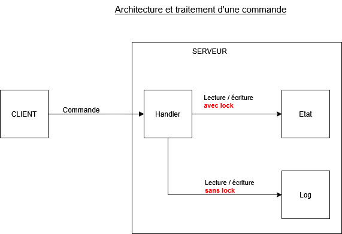

## Analyse d'un serveur existant

### Analyse du code

Les commandes sont interprétées par la fonction handle de IRCHandler qui appelle ensuite les fonctions qui correspondent à chaque commande.

Presque toutes les fonctions du serveur accèdent à la mémoire partagée.

Toutes les informations sont stockées sur le serveur.

Quand on utilise la commande /msg, le message s'écrit correctement mais le code se bloque : le serveur n'interprète aucune commande ensuite sauf /quit.

### Schéma d'architecture

### Limites

#### Aspects positifs

Le fonctionnement est simple à comprendre.

#### Aspects négatifs

Le traitement des commandes manipule à la fois l'état métier, les sockets et la log. Comme conséquences, il n'y a que les méthodes charger_etat et sauvegarder_etat qui peuvent être testées sans ouvrir de socket réseau. Les autres tests sont impossibles sans simuler un client.

Il n'y a pas de types d'erreur, le protocole se contente d'envoyer un message d'erreur au client sans syntaxe particulière.

Il n'y a pas de documentation du protocole.

Ajouter une rétrocompatibilité et/ou une nouvelle commande serait très couteûx car tout le code est concentré dans le même fichier, ce qui va le complexifier de plus en plus.

L'état du serveur est global et, actuellement, il peut devenir bloqué constamment à cause de l'utilisation d'un lock; il ne peut donc être utilisé que par un nombre limité d'utilisateurs.

#### Améliorations

- refactorer le traitement des commandes pour mieux séparer la logique métier, les sockets et la log. Cela facilitera les tests et l'évolution du serveur.
- ajouter une documentation pour le protocole et les erreurs renvoyées par le serveur
- utiliser une base de données pour stocker les données plutôt que la mémoire du serveur et un fichier JSON
